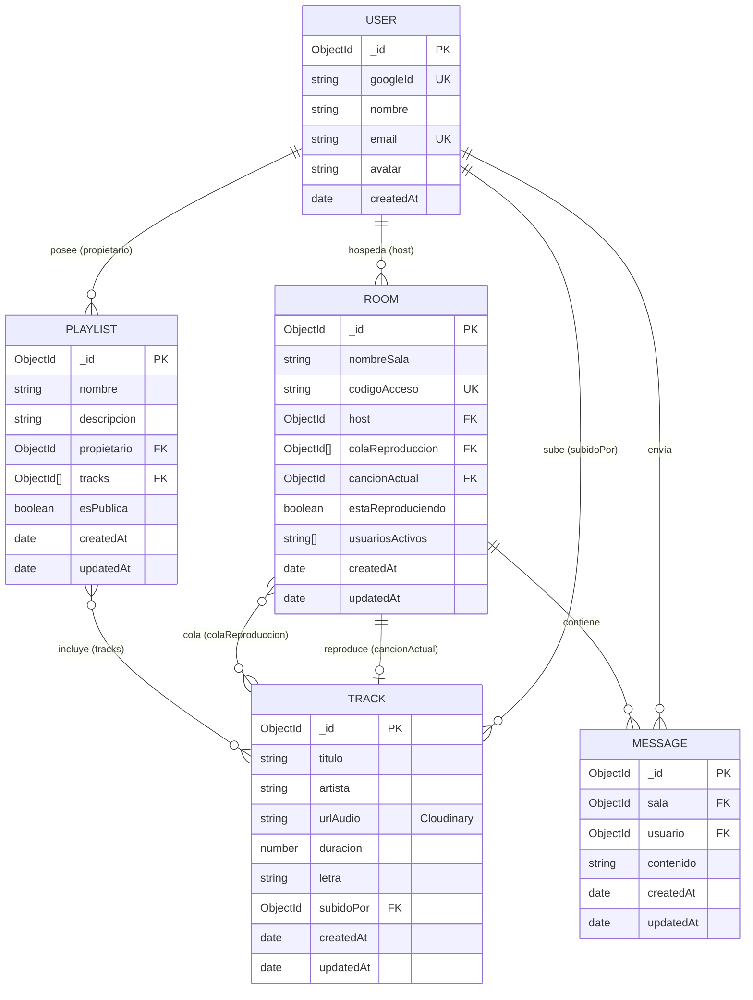

# SonusRoom (SoundSync)

Backend API para salas de música compartidas con sincronización en tiempo real.

**SoundSync** es una aplicación web enfocada en la reproducción y compartición de contenido de audio en tiempo real. Los usuarios pueden subir podcasts, música independiente o grabaciones personales y crear **Salas de Escucha** donde múltiples personas escuchan el mismo contenido sincronizado mientras interactúan mediante chat.

**Integrantes:** Ramiro Santos Rojas · Luis Alberto Carrillo Parra

## Tecnologías y Herramientas Utilizadas hasta el momento

* **Entorno:** Node.js
* **Lenguaje:** TypeScript
* **Framework:** Express.js 5
* **Tiempo real:** Socket.IO
* **Base de datos:** MongoDB + Mongoose
* **Auth:** Passport.js + Google OAuth 2.0 + express-session
* **Almacenamiento de audio:** Cloudinary (Multer)
* **Calidad de código:** ESLint, Prettier, Jest

---

> **Nota:** El archivo `.env` puede estar precargado en el entorno local. Usa `.env.example` como plantilla de las variables necesarias.

### Una vez clonado el repositorio

1. Copia `.env.example` a `.env` y completa los valores.
2. Ten MongoDB corriendo (local o Atlas). Ejemplo local: `mongodb://localhost:27017/sonusroom`
3. Configura Google OAuth (Client ID / Secret) y el callback `http://localhost:3000/api/auth/google/callback`
4. `npm install`
5. `npm run dev`

### Variables de entorno

| Variable | Descripción |
|----------|-------------|
| `PORT` | Puerto del servidor (por defecto `3000`) |
| `MONGODB_URI` | URI de conexión a MongoDB (obligatoria) |
| `CLOUDINARY_CLOUD_NAME` | Nombre de la cuenta Cloudinary |
| `CLOUDINARY_API_KEY` | API key de Cloudinary |
| `CLOUDINARY_API_SECRET` | API secret de Cloudinary |
| `GOOGLE_CLIENT_ID` | Client ID de Google OAuth |
| `GOOGLE_CLIENT_SECRET` | Client secret de Google OAuth |

## Scripts

| Comando | Descripción |
|---------|-------------|
| `npm run dev` | Servidor en desarrollo con hot-reload |
| `npm run build` | Compila TypeScript y copia `views/` a `dist/` |
| `npm run start` | Ejecuta el build en producción |
| `npm run test` | Ejecuta los tests |
| `npm run test:watch` | Tests en modo watch |
| `npm run test:coverage` | Tests con reporte de cobertura |
| `npm run lint` | Revisa el código con ESLint |
| `npm run lint:fix` | Corrige errores de ESLint automáticamente |
| `npm run format` | Formatea el código con Prettier |
| `npm run format:check` | Verifica el formato sin modificar archivos |
| `npm run check` | Ejecuta lint, format:check y test |

## Arranque

**Desarrollo:**

```bash
npm run dev
```

**Producción:**

```bash
npm run build
npm run start
```

El servidor queda en `http://localhost:3000` (o el puerto de `PORT`).

El dashboard de prueba se sirve en `/` (`src/views/`).

## Documentación de la API

La especificación **OpenAPI 3.0** documenta las rutas, parámetros, cuerpos,
respuestas, modelos y autenticación:

- Swagger UI: `http://localhost:3000/api-docs`
- OpenAPI JSON: `http://localhost:3000/api-docs.json`

Para ejecutar rutas protegidas desde Swagger UI:

1. Abre `http://localhost:3000/api/auth/google` e inicia sesión.
2. Regresa a `/api-docs` en el mismo navegador.
3. Abre una operación, selecciona **Try it out** y luego **Execute**.

La cookie de sesión se envía automáticamente. No es necesario copiar un token.
El JSON de OpenAPI también puede importarse en Postman o Insomnia.

## Autenticación

Las mutaciones de salas/tracks y **todas** las conexiones Socket.IO requieren sesión de Google.

| Método | Ruta | Descripción |
|--------|------|-------------|
| `GET` | `/api/auth/google` | Inicia OAuth con Google |
| `GET` | `/api/auth/google/callback` | Callback; éxito → `/`, fallo → `/login-error` |
| `GET` | `/api/auth/logout` | Cierra la sesión |
| `GET` | `/api/auth/current-user` | Indica si hay sesión (`logueado`, `usuario`) |

Flujo típico: abrir `/api/auth/google` en el navegador → iniciar sesión → cookies de sesión habilitadas en peticiones al API y en Socket.IO.

Las rutas marcadas con **Auth** usan el middleware `isAuthorized` (responden `401` si no hay sesión).

## Endpoints

### Dummy

| Método | Ruta | Auth | Descripción |
|--------|------|------|-------------|
| `GET` | `/api/health` | No | Estado del servicio |
| `GET` | `/api/dummy` | No | Respuesta de prueba |

### Salas (`/api/rooms`)

| Método | Ruta | Auth | Descripción |
|--------|------|------|-------------|
| `GET` | `/api/rooms` | Sí | Listar salas |
| `POST` | `/api/rooms` | Sí | Crear sala (`{ "nombreSala": "..." }`) → genera `codigoAcceso` tipo `ROOM-XXXX` |
| `PUT` | `/api/rooms/:codigo` | Sí | Actualizar `cancionActual` y/o `estaReproduciendo` |
| `DELETE` | `/api/rooms/:codigo` | Sí | Eliminar sala |
| `POST` | `/api/rooms/:codigo/upload` | Sí | Subir audio (multipart campo `audio`) + crear track + meterlo en cola. Body: `nombreCancion` (requerido), `artista` |
| `POST` | `/api/rooms/:codigo/queue` | Sí | Añadir un track existente a la cola (`{ "trackId": "..." }`) |

### Tracks (`/api/tracks`)

| Método | Ruta | Auth | Descripción |
|--------|------|------|-------------|
| `GET` | `/api/tracks` | Sí | Listar tracks |
| `GET` | `/api/tracks/:id` | Sí | Obtener track por ID |
| `POST` | `/api/tracks` | Sí | Crear track (multipart campo `file`). Body: `titulo` (requerido), `artista`, `duracion` |
| `POST` | `/api/tracks/:id/lyrics` | Sí | Consume **lyrics.ovh** y guarda la letra en el track. Body opcional: `titulo`, `artista` |
| `PUT` | `/api/tracks/:id` | Sí | Actualizar `titulo`, `artista`, `duracion`, `letra` |
| `DELETE` | `/api/tracks/:id` | Sí | Eliminar track |

### Mensajes (`/api/messages`)

| Método | Ruta | Auth | Descripción |
|--------|------|------|-------------|
| `GET` | `/api/messages` | Sí | Listar mensajes. Query opcional: `?salaId=` |
| `GET` | `/api/messages/:id` | Sí | Obtener mensaje por ID |
| `POST` | `/api/messages` | Sí | Crear mensaje (`{ "salaId": "...", "contenido": "..." }`) |
| `PUT` | `/api/messages/:id` | Sí | Actualizar `contenido` |
| `DELETE` | `/api/messages/:id` | Sí | Eliminar mensaje |

### Playlists (`/api/playlists`)

| Método | Ruta | Auth | Descripción |
|--------|------|------|-------------|
| `GET` | `/api/playlists` | Sí | Listar playlists. Query opcional: `?propietarioId=` |
| `GET` | `/api/playlists/:id` | Sí | Obtener playlist por ID |
| `POST` | `/api/playlists` | Sí | Crear playlist (`{ "nombre": "...", "descripcion?", "esPublica?", "tracks?" }`) |
| `PUT` | `/api/playlists/:id` | Sí | Actualizar `nombre`, `descripcion`, `esPublica`, `tracks` |
| `DELETE` | `/api/playlists/:id` | Sí | Eliminar playlist |

### Dashboard (UI de prueba)

En `http://localhost:3000/` puedes:

1. Iniciar sesión con Google
2. Crear / unirte a una sala
3. Gestionar la **biblioteca de canciones** (crear, editar, borrar, obtener letra vía lyrics.ovh)
4. Usar **A la fila** para meter un track existente en la cola de la sala conectada
5. Reproducir / pausar / siguiente con sincronización vía Socket.IO
6. Usar el **chat de la sala** (crear, listar, editar, borrar mensajes)
7. Gestionar **playlists** (crear, listar, editar, agregar tracks, borrar)

## Socket.IO

Las conexiones requieren la misma sesión de Google. Sin login, el socket se rechaza.

### Cliente → servidor

| Evento | Payload | Descripción |
|--------|---------|-------------|
| `join-room` | `roomCode` | Une al socket a la sala |
| `player-action` | `{ roomCode, action, currentTime, trackId? }` | Play/pause sincronizado |
| `cola-actualizada` | `{ codigoAcceso, colaReproduccion }` | Notifica cambios de cola a otros clientes |
| `next-track` | `{ roomCode }` | Pasa a la siguiente canción de la cola |

### Servidor → cliente

| Evento | Descripción |
|--------|-------------|
| `room-sync-init` | Estado inicial al unirse (`urlAudio`, `estaReproduciendo`, `currentTime`) |
| `player-broadcast` | Difusión de play/pause / cambio de track |
| `actualizar-cola-broadcast` | Cola actualizada |

## Estructura del proyecto

```
src/
├── app.ts                 # Entrada: MongoDB, HTTP, Socket.IO
├── createApp.ts           # Express, sesión, Passport, rutas
├── config/
│   ├── cloudinary.ts      # Multer + Cloudinary
│   └── passport.ts        # Google OAuth strategy
├── controllers/           # Lógica de rooms, tracks, messages, playlists, dummy
├── middlewares/           # isAuthorized
├── models/                # User, Track, Room, Message, Playlist (Mongoose)
├── routes/                # auth, rooms, tracks, messages, playlists, dummy
├── services/              # Consumo de APIs externas (lyrics.ovh)
├── sockets/               # audioSocket (sync + cola)
├── views/                 # Dashboard HTML/JS de prueba
└── __tests__/             # Jest + Supertest
```

## Base de datos

Persistencia en **MongoDB** (local o Atlas) con **Mongoose**.



### Colecciones

| Colección | Descripción | Estado |
|-----------|-------------|--------|
| **User** | Usuario autenticado con Google (`googleId`, `email`, `avatar`) | Implementado |
| **Track** | Audio en Cloudinary + metadata | Implementado |
| **Room** | Sala con `colaReproduccion`, `cancionActual` y sync en vivo | Implementado |
| **Message** | Chat en sala (`sala`, `usuario`, `contenido`) | Implementado |
| **Playlist** | Listas de reproducción del usuario (`tracks`, `esPublica`) | Implementado |

### Servicios externos

| Servicio | Uso |
|----------|-----|
| **Cloudinary** | Archivo de audio; URL en `Track.urlAudio` |
| **Google OAuth** | Identidad; `User.googleId` |
| **lyrics.ovh** | API REST externa; letra en `Track.letra` vía `POST /api/tracks/:id/lyrics` |
| **Socket.IO** | Sync de reproducción y cola |

## Tests

Ejecutar toda la suite:

```bash
npm run test
```

Ejecutarla una sola vez y en serie:

```bash
npm test -- --runInBand
```

Generar el reporte de cobertura:

```bash
npm run test:coverage
```

La suite usa **Jest**, **Supertest** y mocks para evitar llamadas reales a Google OAuth y
lyrics.ovh. Actualmente cubre:

- Endpoints públicos `/api/health` y `/api/dummy`.
- Middleware de autorización para sesiones autenticadas y respuestas `401`.
- Servicio de letras: éxito, parámetros codificados, letras ausentes, errores HTTP y fallos de red.
- Flujos HTTP sin sesión: redirección al login, usuario actual, OAuth no configurado, rutas protegidas y OpenAPI.

Los siguientes módulos están reservados para completar:

- `playlistController.test.ts`: pruebas unitarias del controlador con `Playlist` y `Track` simulados.
- `roomRoutes.integration.test.ts`: ciclo de salas con Supertest y MongoDB en memoria.

Los casos pendientes usan `test.todo`, por lo que Jest los reporta sin ejecutarlos ni marcar la
suite como fallida.

El marco de trabajo implementado al momento:


