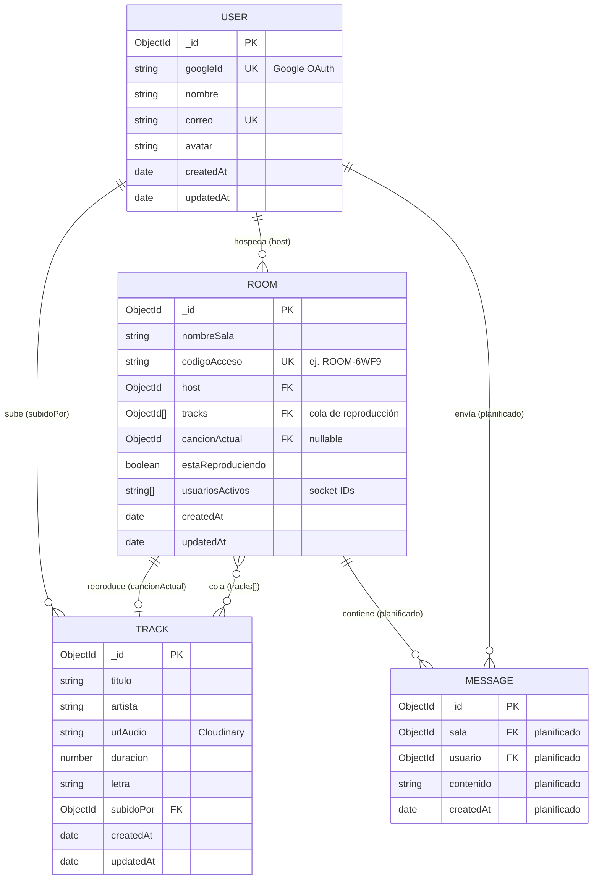

# SonusRoom (SoundSync)

Backend API para salas de música compartidas con sincronización en tiempo real.

**SoundSync** es una aplicación web enfocada en la reproducción y compartición de contenido de audio en tiempo real. Los usuarios pueden subir podcasts, música independiente o grabaciones personales y crear **Salas de Escucha** donde múltiples personas escuchan el mismo contenido sincronizado mientras interactúan mediante chat.

**Integrantes:** Ramiro Santos Rojas · Luis Alberto Carrillo Parra

## Tecnologías y Herramientas Utilizadas hasta el momento

* **Entorno de Ejecución:** Node.js
* **Lenguaje:** TypeScript
* **Framework Web:** Express.js
* **Tiempo Real (WebSockets):** Socket.io
* **Base de Datos:** MongoDB
* **Almacenamiento en la Nube:** Cloudinary
* **Calidad de código:** ESLint, Prettier, Jest

---

> **Nota:** El archivo `.env` ya se encuentra precargado y guardado en el repositorio con las credenciales activas de Cloudinary.

También existe `.env.example` como plantilla de referencia con las variables necesarias.

### Una vez clonado el repositorio hacer lo siguiente:

### Configuración de la Base de Datos Local (MongoDB)

Para que el servidor pueda guardar las canciones y las salas se necesita una instancia local de MongoDB corriendo, en `.env` coloca tu propia url por defecto para conectarte, como en mi caso fue: `mongodb://localhost:27017`

Una vez teniendo mongo:

1. Correr `npm install` para instalar las dependencias del `package.json`
2. `npm run dev` para levantar el servidor local

### Variables de entorno

| Variable | Descripción |
|----------|-------------|
| `PORT` | Puerto del servidor (por defecto `3000`) |
| `MONGODB_URI` | URI de conexión a MongoDB |
| `CLOUDINARY_CLOUD_NAME` | Nombre de tu cuenta en Cloudinary |
| `CLOUDINARY_API_KEY` | API key de Cloudinary |
| `CLOUDINARY_API_SECRET` | API secret de Cloudinary |

## Scripts

| Comando | Descripción |
|---------|-------------|
| `npm run dev` | Servidor en desarrollo con hot-reload |
| `npm run build` | Compila TypeScript a `dist/` |
| `npm run start` | Ejecuta el build en producción |
| `npm run test` | Ejecuta los tests |
| `npm run test:watch` | Tests en modo watch |
| `npm run test:coverage` | Tests con reporte de cobertura |
| `npm run lint` | Revisa el código con ESLint |
| `npm run lint:fix` | Corrige errores de ESLint automáticamente |
| `npm run format` | Formatea el código con Prettier |
| `npm run format:check` | Verifica el formato sin modificar archivos |
| `npm run check` | Ejecuta lint, format:check y test |

## Arranque

**Desarrollo:**

```bash
npm run dev
```

**Producción:**

```bash
npm run build
npm run start
```

El servidor quedará disponible en `http://localhost:3000` (o el puerto definido en `PORT`).

## Endpoints

### Dummy

| Método | Ruta | Descripción |
|--------|------|-------------|
| `GET` | `/api/health` | Estado del servicio |
| `GET` | `/api/dummy` | Respuesta de prueba |

### Salas (`/api/rooms`)

| Método | Ruta | Descripción |
|--------|------|-------------|
| `POST` | `/api/rooms` | Crear sala |
| `GET` | `/api/rooms` | Listar salas |
| `PUT` | `/api/rooms/:codigo` | Actualizar estado de la sala |
| `DELETE` | `/api/rooms/:codigo` | Eliminar sala |

### Tracks (`/api/tracks`)

| Método | Ruta | Descripción |
|--------|------|-------------|
| `POST` | `/api/tracks` | Subir track (multipart, campo `file`) |
| `GET` | `/api/tracks` | Listar tracks |
| `GET` | `/api/tracks/:id` | Obtener track por ID |
| `PUT` | `/api/tracks/:id` | Actualizar track |
| `DELETE` | `/api/tracks/:id` | Eliminar track |

## Estructura del proyecto

```
src/
├── app.ts              # Punto de entrada (servidor + MongoDB + sockets)
├── createApp.ts        # Factory de Express (reutilizable en tests)
├── config/             # Configuración externa (Cloudinary)
├── controllers/        # Lógica de negocio
├── models/             # Esquemas Mongoose
├── routes/             # Definición de rutas
├── sockets/            # WebSockets (audio en tiempo real)
├── views/              # Prototipo HTML para pruebas de sockets
└── __tests__/          # Tests con Jest
```

## Base de datos

La persistencia se realiza en **MongoDB** (local en desarrollo / **MongoDB Atlas** en producción) mediante **Mongoose**. El diagrama refleja las colecciones implementadas en el repositorio y la entidad de **chat** planificada según la visión del proyecto.



### Relaciones principales

| Colección | Descripción | Estado |
|-----------|-------------|--------|
| **User** | Usuario autenticado vía Google OAuth (`googleId`, `correo`, `avatar`) | Implementado |
| **Track** | Audio subido a Cloudinary (música, podcasts, grabaciones) | Implementado |
| **Room** | Sala de escucha con cola de tracks (`tracks[]`), reproducción sincronizada y estado en tiempo real | Implementado (`tracks[]` planificado en modelo) |
| **Message** | Mensajes de chat dentro de una sala | Planificado |

### Servicios externos vinculados al modelo

| Servicio | Uso en la base de datos |
|----------|-------------------------|
| **Cloudinary** | Almacena el archivo de audio; `Track.urlAudio` guarda la URL |
| **Google OAuth** | Identifica al usuario; `User.googleId` es la clave única |
| **Socket.IO** | Sincroniza reproducción en `Room`; `usuariosActivos` rastrea conexiones en vivo |
| **APIs de metadata** *(Spotify, Last.fm, Listen Notes)* | Enriquecimiento futuro de `Track` (portada, género, autor) |

## Pruebas con Postman

Envía una petición **POST** a `http://localhost:3000/api/rooms` con el siguiente cuerpo en formato JSON:

```json
{
  "nombreSala": "Nombre de sala"
}
```

Una vez hecha la petición se responderá con un 201 created y se generará un código de acceso aleatorio como ROOM-6WF9, si se quieren ver las salas activas se puede usar la ruta http://localhost:3000/api/rooms

Para probar: ya levantado el servidor local e ingresando a localhost:3000 se ingresa la sala creada en dos pestañas diferentes y se conecta, se reproduce y pausa el audio para comprobar funcionamiento.

## Tests

```bash
npm run test
```

Los endpoints dummy (`/api/health`, `/api/dummy`) tienen cobertura de tests con Jest y Supertest.

El marco de trabajo implementado al momento ese el siguiente:


